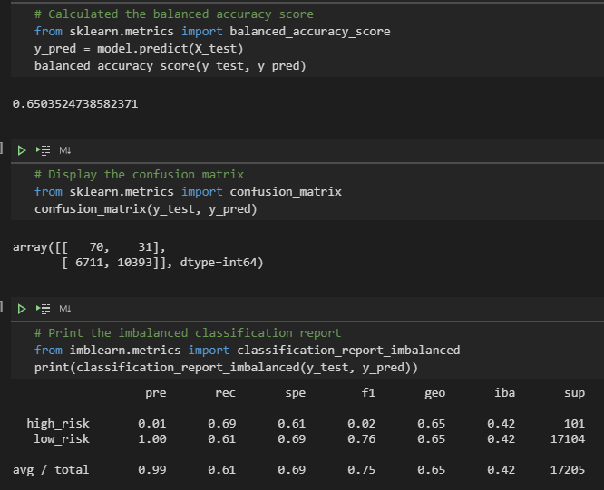
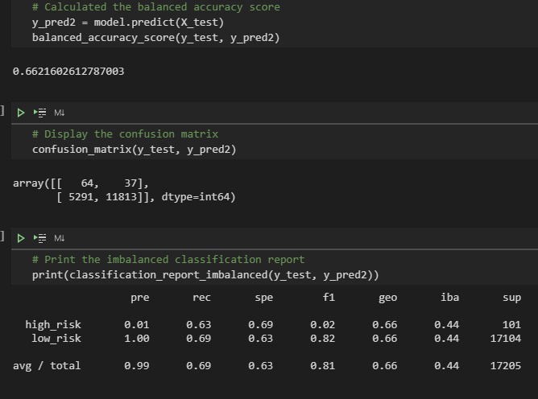
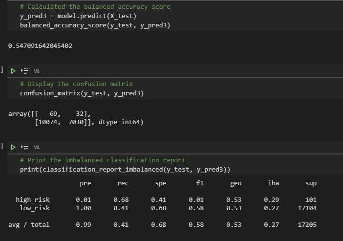
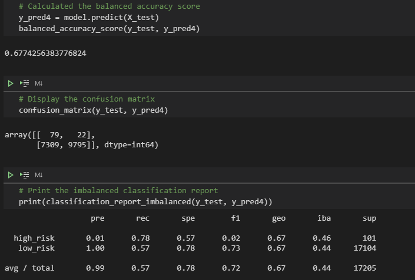
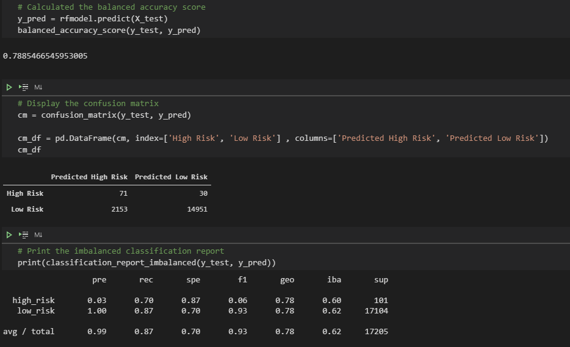
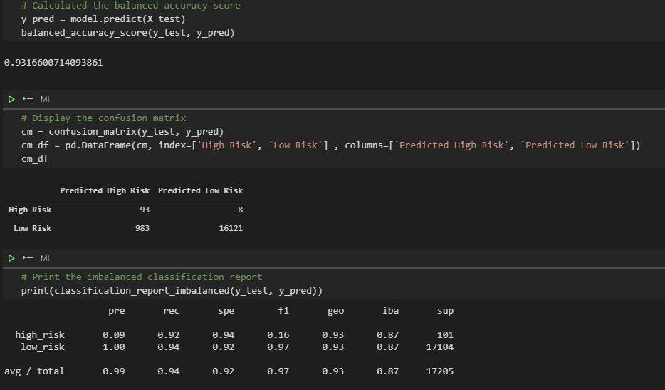

# CREDIT RISK ANALYSIS

To predict credit risk, evaluate the performance of different Machine Learning models.
Dataset was split into inputs and outputs. Since the data is imbalanced we will incorporate sampling strategies to improve the model's prediction for Credit Loss or risk.

## Purpose

- To train and evaluate models with various criteria (inputs) to determine the best model that accurately predicts credit risk.

## Resource

- Jupyter Lab v2.2.6
- VS Code v1.52.1
- Data Resource - LoanStats_2019Q1.csv

## Process / Steps

- Clean and parse data - change variables into numericals, drop NaNs. 
- Methodologies -
    - Naive Random Over Sampling
    - SMOTE Over Samoling
    - Cluster Centroids Under Sampling
    - SMOTEENN a combined sampling 
    - Balanced Random Forest Classifier
    - AdaBoost (Adaptive Boost) Classifier
- Using Logistic Regression for prediction
- Accuracy of the model
- Confusion Matrix
- Imbalance Classification Report.

## Results

### (1) **Naive Random Sampling**

### (2) **SMOTE Over Sampling**

### (3) **Cluster Centroids Under-Sampling**

### (4) **SMOTEENN**

### (5) **Balanced Random Forest Classifier**

### (6) **Adaptive boost (Easy Ensemble Classifier)**

- Balanced Accuracy Scores:
    - Naive Random Sampling - 65.0
    - SMOTE Over Sampling -  66.21
    - Cluster Centroids Under Sampling - 54.7
    - SMOTEENN a combined sampling - 67.7
    - Balanced Random Forest Classifier - 78.8
    - Easy Ensemble Adaptive Boost Classifier - 93.1

Observation noted during accuracy scores for each model ranges from 65% up to 93%. This accuracy score is due to the dataset and its imbalance or sensitivity to class sizes.

- Precision Scores:
    - Naive Random Sampling - 65.0
    - SMOTE Over Sampling -  66.21
    - Cluster Centroids Under Sampling - 54.7
    - SMOTEENN a combined sampling - 67.7
    - Balanced Random Forest Classifier - 78.8
    - Easy Ensemble Adaptive Boost Classifier - 93.1  

## Summary

